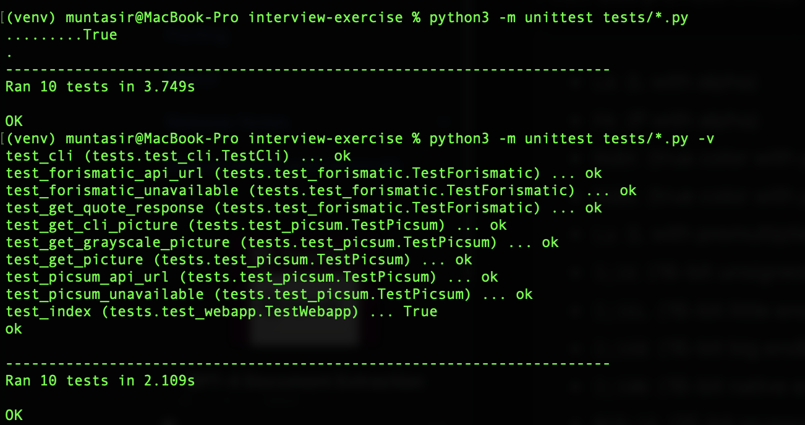
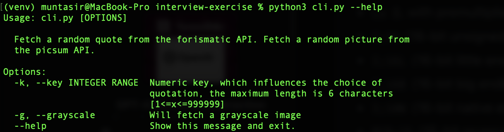
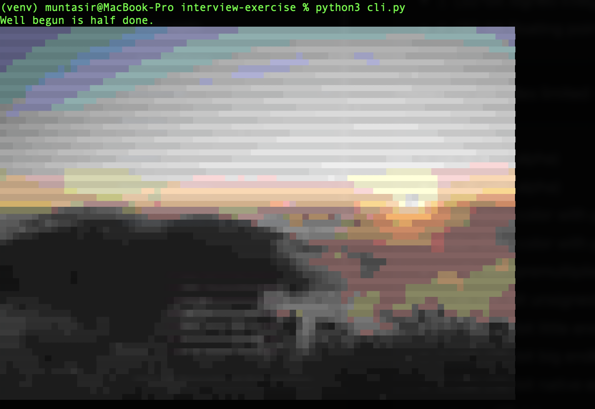
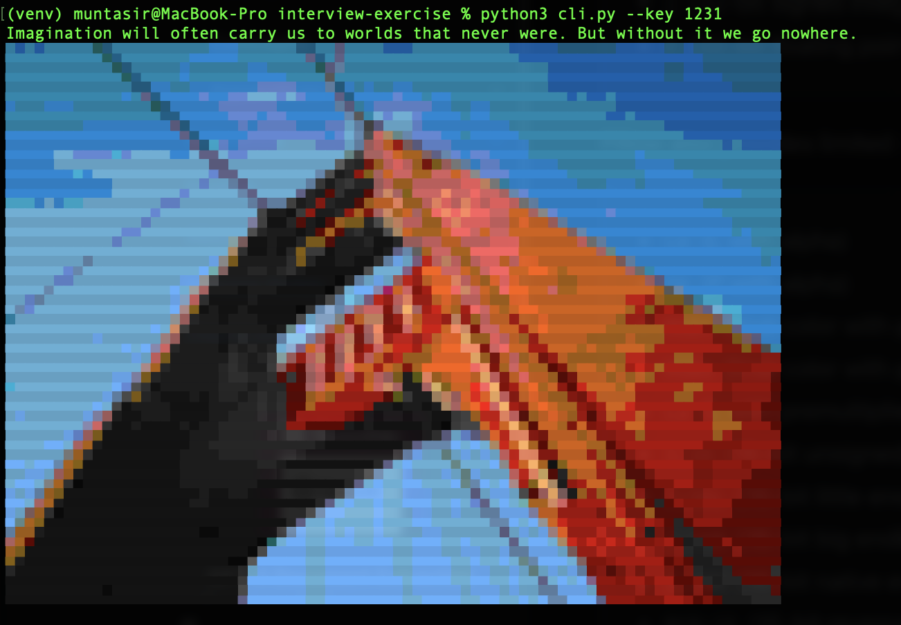
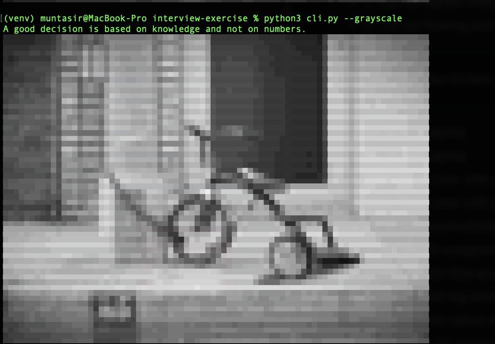
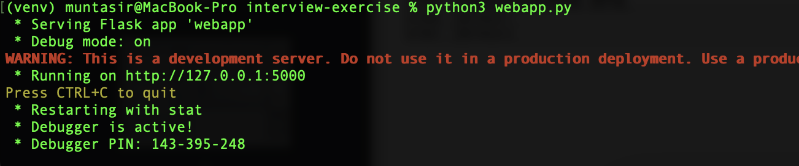
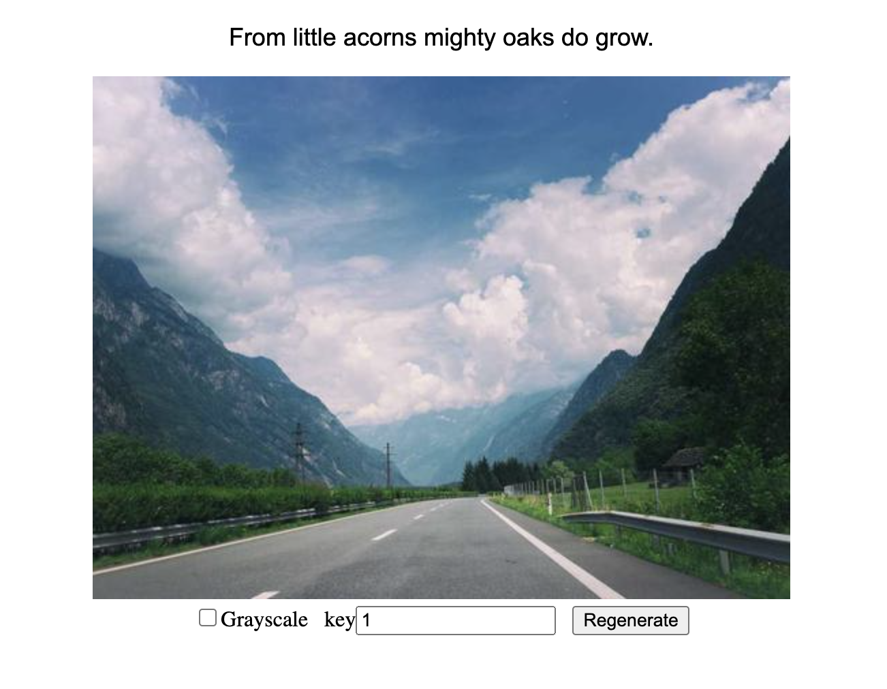
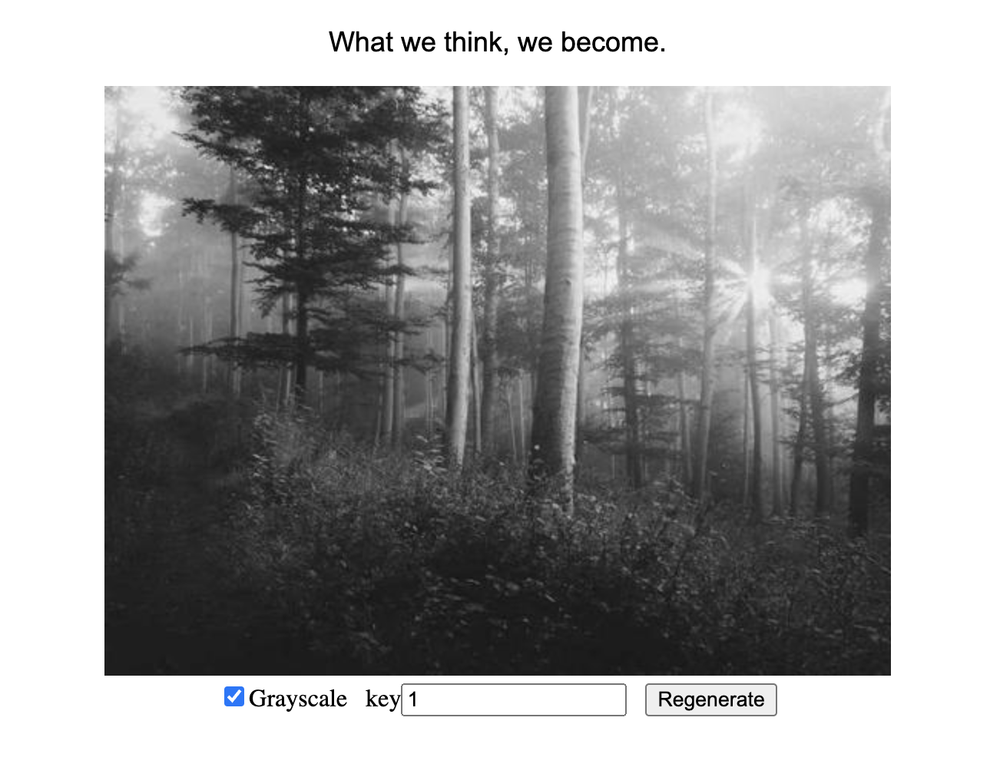

# interview-exercise
Tucows Interview Exercise

This project requires `python3`. It implements [flask](https://flask.palletsprojects.com/en/3.0.x/) for the `webapp` and [CLImage](https://github.com/pnappa/CLImage) to convert images to beautiful ANSI escape codes to display in command line interfaces.

After cloning/downloading the project please follow these instructions to run and test:

Get inside project folder and setup the project:  

```
cd interview-exercise.
python3 -m venv venv
. venv/bin/activate
pip install -r requirements.txt
```

### Unit Test

Please run the following for unit testing
```
python3 -m unittest tests/test*.py -v
```



### cli
```
python3 cli.py --help
```



Running cli with no options
```
python3 cli.py
```



Running cli with `key`
```
python3 cli.py --key 1231
```




Running cli with `grayscale`
```
python3 cli.py --grayscale
```



### Web app

Starting the development server 
```
python3 webapp.py 
```


Please open a browswer and go to this address `http://127.0.0.1:5000/`. Key is defaulted to `1` and `Grayscale` options are unselected.



With `Grayscale`

